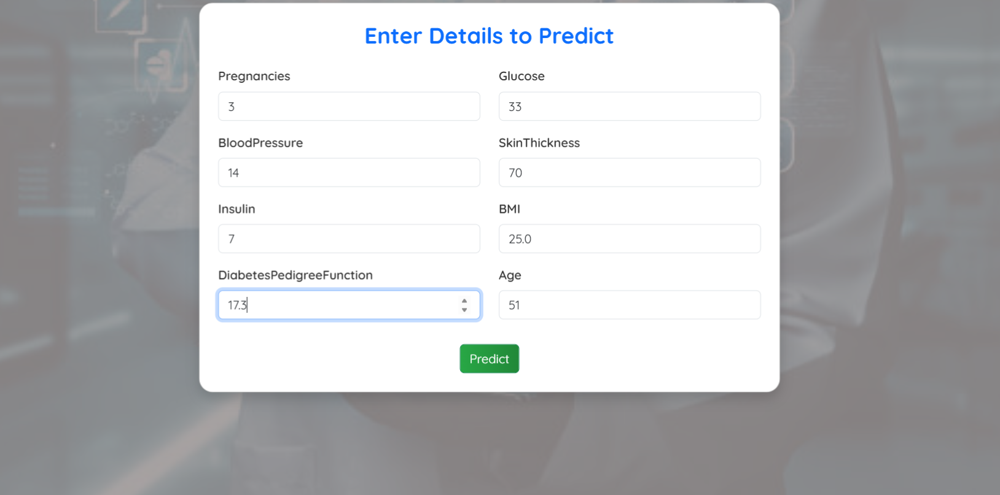

# RUN
.\.venv\Scripts\activate
cd backend
python app.py
   Another terminal 
   cd frontend
npm run dev

---

## 🛠️ Future Enhancements

- 📊 Prediction history
- 👤 User login/signup
- 📈 Data visualization
- 📥 Download result as PDF

---

## 🧑‍💻 Developer

**App Name:** AI DiabPredictor  
**Developed by:** [Your Name Here]  
**Year:** 2025

---

## 📷 Screenshots

---

## 🔗 Demo

*Include Netlify/Render/Heroku link if hosted*

---

## 📄 License

This project is licensed under the MIT License.
